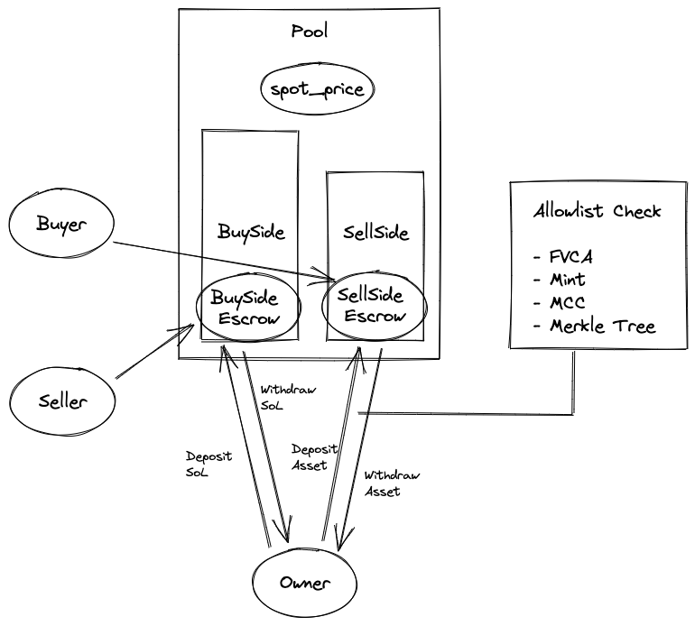
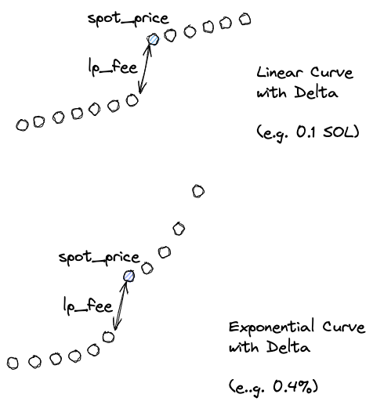
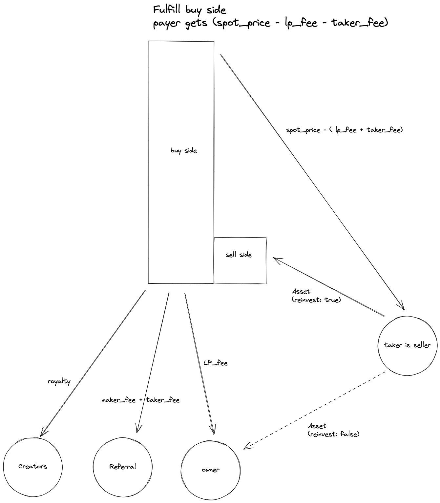
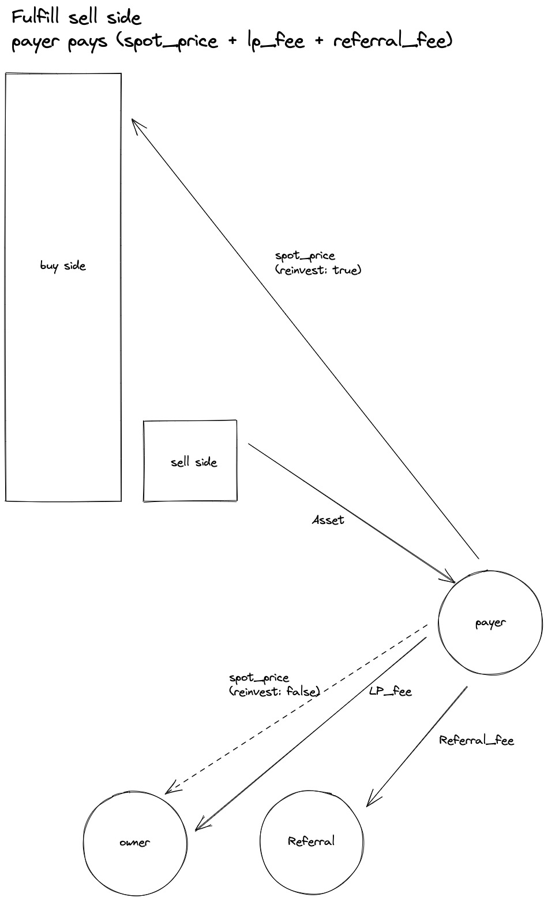

# MMM

MMM is an open source and secure AMM protocol on Solana. It enables the multi-pool (buy-side, sell-side, two-side) feature, spl support, and the extendable allowlist of the pool assets.

| Network | Program Address |
| ----------- | ----------- |
| Devnet  | mmm3XBJg5gk8XJxEKBvdgptZz6SgK4tXvn36sodowMc|
| Mainnet |    mmm3XBJg5gk8XJxEKBvdgptZz6SgK4tXvn36sodowMc     |


## Motivation

We'd like to introduce the standard of AMM to maximize the liquidity for traders, creators, and collectors.


## Build status


## Features

- multi-pool
  - buy-side (e.g. collection offers)
  - sell-side
  - two-side
- expiry on the pool
- extendable asset pool allowlist definition
  - FVCA (first verified creator address)
  - Mint Address (for SFT, or single NFT)
  - MCC Collection Standard
  - Merkle Tree (coming soon)
- cosign and cosigner annotations
- multiple bonding curves
  - linear
  - exponential
  - reverse linear (coming soon)
  - reverse exponential (coming soon)
- spl support (coming soon)

<b>Built with</b>
- [anchor](https://github.com/coral-xyz/anchor)

## Architecture Overview

Overview of the pool accounts
- Owner: owner is the only one who can do the actions like create, update, deposit, or withdraw.
- Cosigner: cosigner is optional.
- Buyer: buyer can buy from the sell-side liquidity of the pool.
- Seller: seller can sell into the the buy-side liquidity of the pool.
- Curve: curve is the bonding curve that moves the spot_price of the pool.
- Allowlist: allowlist is a fixed length array that defines what assets can be deposit or trade in/out of the pool. Currectly it supports a list of options like (FVCA, Mint, MCC, Merkle Tree).
- LP Fee: Liquidity provider fee. When the pool has enough two-side liquidity, the liquidity pool owner can earn the lp fee. Buy-side liquidity needs to have SOL or SPL greater than the spot_price, and sell-side liquidity needs to have at least 1 asset.

Overview



Bonding Curve



Fulfill Buy Side



Fulfill Sell Side



## MMM Javascript/Typescript SDK
Coming soon

## State Account
With the state account and IDL, it's useful to build up the getProgramAccounts filter params with the right size/offset.

```rust
#[account]
#[derive(Default)]
pub struct Pool { // 8 bytes anchor discriminator
    pub spot_price: u64,
    pub curve_type: u8,
    pub curve_delta: u64,
    pub reinvest_fulfill_buy: bool,
    pub reinvest_fulfill_sell: bool,
    pub expiry: i64,
    pub lp_fee_bp: u16,
    pub referral: Pubkey,
    pub referral_bp: u16,
    pub cosigner_annotation: [u8; 32],
    pub sellside_orders_count: u64,
    pub lp_fee_earned: u64,
    pub owner: Pubkey,
    pub cosigner: Pubkey,
    pub uuid: Pubkey,
    pub payment_mint: Pubkey,
    pub allowlists: [Allowlist; ALLOWLIST_MAX_LEN],
}
```

## Build and Test
```bash
anchor build
anchor test
```

## Security
https://magiceden.io/.well-known/security.txt

## License
MIT © [MagicEden Open Source](https://github.com/magiceden-oss)
